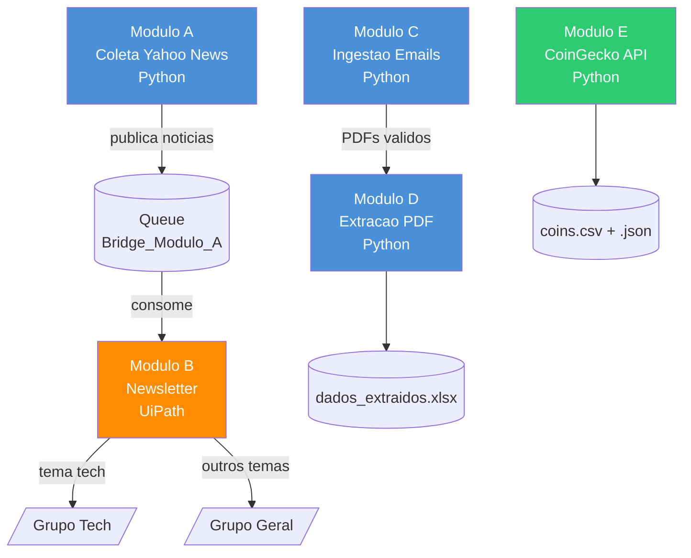
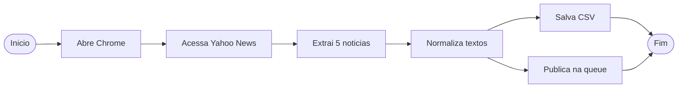
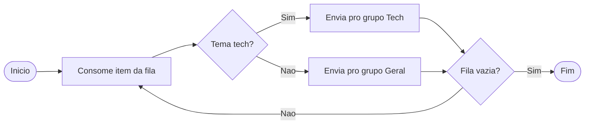
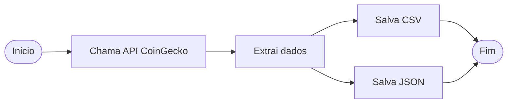

# PDD/SDD — Bridge Case RPA

## 1. Visao Geral

Projeto de automacao RPA dividido em 5 modulos. O fluxo cobre desde coleta de noticias na web ate extracao de dados de PDFs, passando por distribuicao de emails e consumo de API publica.

Os modulos se comunicam pelas queues do UiPath Orchestrator. O modulo E e independente.

| Modulo | O que faz                      | Tecnologia        |
| ------ | ------------------------------ | ----------------- |
| A      | Coleta noticias do Yahoo News  | Python + Selenium |
| B      | Distribui noticias por email   | UiPath Studio     |
| C      | Le emails e salva PDFs validos | Python + IMAP     |
| D      | Extrai CPF/CEP dos PDFs        | Python + PyPDF2   |
| E      | Consome API do CoinGecko       | Python + Requests |

---

## 2. Arquitetura



**A e B se conectam pela queue** — o Python publica via API REST, o UiPath consome nativamente. C e D se conectam por disco (PDFs salvos em pasta). E roda sozinho.

---

## 3. Modulos

### Modulo A — Coleta Web & Normalizacao

Abre o Yahoo News com Selenium, extrai as 5 noticias do bloco "Stories for you", limpa os textos e publica na fila do Orchestrator. Tambem salva um CSV por dia.



- **Campos:** titulo, resumo, tema, fonte, tempo_leitura
- **Retry:** 3 tentativas com espera exponencial
- **Idempotencia:** CSV por dia, checa duplicatas pelo titulo

### Modulo B — Newsletter (UiPath)

Consome da fila `Bridge_Modulo_A`, checa o tema de cada noticia e direciona pro grupo certo. Credenciais e listas de email ficam nos Assets do Orchestrator — ninguem precisa mexer no codigo pra adicionar destinatarios.



**Assets do Orchestrator:**

| Asset                       | Tipo       | Funcao                              |
| --------------------------- | ---------- | ----------------------------------- |
| `gmail_conta_envio_email` | Credential | credenciais do Gmail                |
| `lista_email_geral`       | Text       | destinatarios do grupo geral        |
| `lista_email_grupo_tech`  | Text       | destinatarios do grupo tech         |
| `tema_email_tech`         | Text       | temas que identificam noticias tech |

**Contas de email:**

| Email                             | Papel                                  |
| --------------------------------- | -------------------------------------- |
| `rpageralvini@gmail.com`        | recebe newsletters do grupo geral      |
| `rpatechvini@gmail.com`         | recebe newsletters do grupo tech       |
| `rpa.case.vinicius01@gmail.com` | conta principal — usada pelo modulo C |

### Modulo C — Ingestao de Emails & Anexos

Conecta no Gmail por IMAP, busca emails com assunto "Relatório Diário", valida os PDFs anexados e salva os validos organizados por data. Responde o remetente confirmando recebimento.

```mermaid

```

- **Duplicatas:** controla por UID do email, salvo em arquivo `.txt`
- **Rejeicao:** grava arquivo em `inbox/rejected/` com motivo

### Modulo D — Extracao de Dados de PDF

Le os PDFs do modulo C, extrai CPF e CEP com regex, valida o formato, normaliza e salva tudo em XLSX.

```mermaid

```

- **Colunas:** arquivo, cpf, cpf_valido, cep, cep_valido, erro
- **Regex CPF:** `\d{3}\.\d{3}\.\d{3}\-\d{2}` ou `\d{11}`
- **Regex CEP:** `\d{5}\-\d{3}` ou `\d{8}`

### Modulo E — API CoinGecko (Repo Separado)

Consome a API publica do CoinGecko pra pegar as maiores criptomoedas por capitalizacao. Salva em CSV (idempotente por dia) e JSON.



- **Retry:** backoff exponencial (base 2s), maximo 3 tentativas
- **Idempotencia:** CSV por dia, checa IDs existentes

---

## 4. Requisitos Transversais

**Logs** — JSON estruturado em todos os modulos. Campos: timestamp, nivel, modulo, mensagem. Tudo gravado em `system/data/logs/app.log`.

**Metricas** — toda classe principal rastreia: recebidos, processados, rejeitados, tempo medio e taxa de sucesso. No final, printa um resumo em JSON.

**Idempotencia** — CSV por dia com checagem de IDs (modulos A e E). Controle de UID por arquivo (modulo C). Nenhum modulo reprocessa o que ja foi feito.

**Resiliencia** — retry com espera exponencial nos modulos A e E. Try/except separando erros temporarios (tenta de novo) de erros de negocio (loga e segue).

**Configs** — tudo fora do codigo. Python usa `.env` via `python-dotenv`. UiPath usa Assets do Orchestrator. Nenhuma credencial hardcoded.
